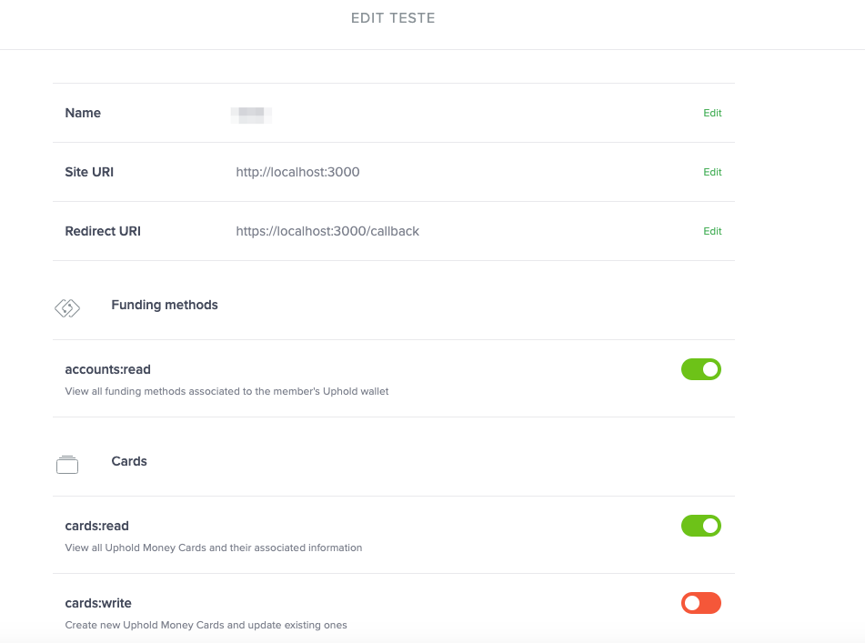

# Authentication

Uphold is an OAuth 2.0 compliant service.

It is mandatory that partners with **Business Accounts** looking to integrate with this API <u>**must request**</u> Uphold to [register an application](https://support.uphold.com/hc/en-us/articles/217210266) and access roles. 

 

## Production/Sandbox Endpoints

- **Production** - Site/API
  - `https://uphold.com` 
  - `https://api-uphold.com` 
- **Sandbox** - Site/API
  - `https://sandbox.uphold.com` 
  - `https://api-sandbox.com` 

**Please use the correct Endpoint for your scenario.** For documentation proposes we are going to use the sandbox Urls.


## Web application flow 

Ideal for Partner web/mobile applications that wish to retrieve information about a user's Uphold account or take actions <u>on their behalf</u>. 

### Use case

Web/Mobile application that implement a user-facing web interface, to provide custom functionality for multiple Uphold users. This Auth-flow is usually used by Partners looking to integrate with Uphold API.

[Uphold javascript web application authentication sample](https://github.com/uphold/rest-api-examples/rest-api/javascript/authentication/web-application-flow)

### Workflow after Uphold request approval 

#### Step 1 - Authorization request!

Partner **application** should redirect users to the following URL:

`https://sandbox.uphold.com/authorize/<client_id>` 

<u>Parameters:</u>

Parameter | Required | Description
--------- | -------- | ----------------------------------------------------------------------------------------------------------------------------------------
intention | no       | Unauthenticated users will be redirected to the `login` page, this behavior can be changed by sending `signup` as the `intention` value.
scope     | **yes**  | Permissions to request from the user.
state     | **yes**  | An unguessable, cryptographically secure random string used to protect against cross-site request forgery attacks.

<u>Example:</u>

`https://sandbox.uphold.com/authorize/MY_CLIENT_ID?scope=user:read&state=MY_UNGUESSABLE_STATE`


If everything goes well the Uphold API executes a callback URL **previously** defined by the Partner after Uphold **application/roles** request approval.

 

#### Step 2 - Requesting an access Token

If the user accepts your request, Uphold will redirect the user back to the Partner callback URL with a temporary `code` and the previously provided `state`, _as is_.

This temporary `code` is valid for a duration of **5 minutes** and **can only be used once**.

The Partner application is **now** responsible for ensuring that the `state` matches the value previously provided, thus preventing a malicious third-party from forging this request.

**Now**, you may then exchange this `code` for an `access token` using the following endpoint:

`POST https://api-sandbox.uphold.com/oauth2/token` 

<u>Parameters:</u>

| Parameter     | Required | Description                                                  |
| ------------- | -------- | ------------------------------------------------------------ |
| client_id     | **yes**  | The application's *clientId*. Please use HTTP Basic Authentication when possible. |
| client_secret | **yes**  | The application's *clientSecret*. Please use HTTP Basic Authentication when possible. |
| code          | **yes**  | The code acquired in step 1.                                 |
| grant_type    | **yes**  | Must be set to *'authorization_code'*.                       |

> Here is a curl example to request exchanging the `code` for a `token`:

```bash
curl https://api-sandbox.uphold.com/oauth2/token \
  -X POST \
  -H "Content-Type: application/x-www-form-urlencoded" \
  -u <clientId>:<clientSecret> \
  -d 'code=<code>&grant_type=authorization_code'
```

> If your request for a token checks out, then our API will return the following:

```json
{
  "access_token": "41ee8b1fa14042e031fe304bb4793b54e6576d19b306dc205136172b80d59d20",
  "expires_in": null
}
```

<aside class="notice">
  <strong>Important Notice</strong>: We recommend encoding the <i>clientId</i> and <i>clientSecret</i> with the HTTP Basic Authentication scheme, instead of authenticating via the request body.
</aside>
Once you have obtained an access token you may call any protected API method on behalf of the user using the "Authorization" HTTP header in the format:

`Authorization: Bearer <token>`

#### Step 3 - Using the access token to get my cards

Finally, the Partner application can now use the provided **token** to query other protected endpoints of Uphold API.

> Request using the 'Authorization' header:

```bash
curl https://api-sandbox.uphold.com/v0/me/cards \
  -H "Authorization: Bearer <token>"
```


## Client credentials flow

For **business usage only**.  Partners may choose to use client credentials authentication, this requires manual approval from Uphold with a **particular custom role approval**.

### Use case

Ideal for backend integrations that do not require access to **other** Uphold user accounts.

[Uphold javascript client credential authentication sample](https://github.com/uphold/rest-api-examples/rest-api/javascript/authentication/client-credential-flow)

#### Step 1 - Creating a token

> To create a client credentials token, execute the following command (make sure the application is set to use <u>client credentials</u> and not authorization code):

```bash
curl https://api-sandbox.uphold.com/oauth2/token \
  -X POST \
  -H "Content-Type: application/x-www-form-urlencoded" \
  -u <clientId>:<clientSecret> \
  -d 'grant_type=client_credentials'
```

<u>Parameters:</u>

Parameter     | Required | Description
------------- | -------- | -------------------------------------------------------------------------------------
client_id     | **yes**  | The application's *clientId*. Please use HTTP Basic Authentication when possible.
client_secret | **yes**  | The application's *clientSecret*. Please use HTTP Basic Authentication when possible.
grant_type    | **yes**  | Must be set to ***'client_credentials'***. 

<aside class="notice">
  <strong>Important Notice</strong>: We recommend encoding the <i>clientId</i> and <i>clientSecret</i> with the HTTP Basic Authentication scheme, instead of authenticating via the request body.
</aside>
Once you have obtained an access token you may call any protected API method on behalf of the user using the "Authorization" HTTP header in the format:

`Authorization: Bearer <token>`

#### Step 2 - Using the token to get my cards

Finally, the Partner application can now use the provided **token** to query other protected endpoints of Uphold API.

> Request using the 'Authorization header':

```bash
curl https://api-sandbox.uphold.com/v0/me/cards \
  -H "Authorization: Bearer <token>"
```


## Personal Access Tokens (PAT)

For **personal usage only** you may choose to use a **PAT**. This token establishes who you are, provides full access to your user account and <u>bypasses Two Factor Authentication, if enabled</u>. For this reason it should be treated just like your email/password combination, i.e. remain secret and never shared with third parties. PATs can be issued and revoked individually.

### Use case

Ideal for scripts, automated tools and command-line programs which remain under your control.

[Uphold javascript PAT authentication sample](https://github.com/uphold/rest-api-examples/rest-api/javascript/authentication/client-credential-pat)

#### Step 1 - Creating a PAT

> To create a Personal Access Token, execute the following command:

```bash
curl https://api-sandbox.uphold.com/v0/me/tokens \
  -X POST \
  -H "Authorization: Basic <username:password>" \
  -H "Content-Type: application/json" \
  -H "OTP-Method-Id: <Method-Id>" \
  -H "OTP-Token: <OTP-Token>" \
  -d '{ "description": "My command line script" }'
```

**IMPORTANT**

1. Uses **Basic Authentication** to create the PAT.
2.  **username:password** combination should be encoded with **Base64**
3. **OTP-Method-ID** and **OTP-Token** are <u>mandatory</u> if the account has 2FA enabled.

> The above command returns the following JSON:

```json
{
    "accessToken":"c386ae9c4557c1c661b15911071b06d9e6c3fc9a",
    "description":"My command line script",
    "id":"a97bb994-6e24-4a89-b653-e0a6d0bcf634"
}
```

<u>Parameters:</u>

| Parameter   | Required | Description                               |
| ----------- | -------- | ----------------------------------------- |
| description | **yes**  | A human-readable description of this PAT. |

#### Step 2 - Managing PAT

##### Listing PAT's

> To list active Personal Access Tokens, execute the following command:

```bash
curl https://api-sandbox.uphold.com/v0/me/tokens \
  -H "Authorization: Bearer <token>"
```

> The above command returns the following JSON:

```json
[
  {
      "id": "a97bb994-6e24-4a89-b653-e0a6d0bcf634",
      "description": "token 1"
  },
  {
      "id": "b97bb994-6e24-4a89-b653-e0a6d0bcf635",
      "description": "token 2"
  }
]
```

To list Personal Access Tokens you may use the following endpoint:

`GET https://api-sandbox.uphold.com/v0/me/tokens`

##### Revoking a PAT

> To revoke a Personal Access Token, execute the following command:

```bash
curl https://api-sandbox.uphold.com/v0/me/tokens/:token \
  -X DELETE \
  -H "Authorization: Bearer <token>"
```

To revoke a Personal Access Token you may use the following endpoint:

`DELETE https://api-sandbox.uphold.com/v0/me/tokens/:token` 

<u>Parameters:</u>

Parameter | Required | Description
--------- | -------- | ---------------------------
token     | **yes**  | The PAT you wish to revoke.

#### Step 3 - Using a PAT to get my data

> Example of using a personal access token to make requests to our API:

```bash
curl https://api-sandbox.uphold.com/v0/me \
  -H "Authorization: Bearer <token>"
```

A PAT may be used for authenticating a request via the OAuth scheme.

The `<token>` should be set as the `accessToken` received during creation.


## Security Notice (Web Flow/Client Credential/PAT)- Token Header

Once you have obtained a **token** you may call any protected API method using the "Authorization" HTTP header in the format:

`Authorization: Bearer <token>`

<aside class="notice">
No other method of authentication is supported. For security reasons only the "Authorization" header will be processed.
This prevents attackers from stealing tokens from the user's browser history, logs, referer headers and other insecure locations when credentials are sent via query URLs.


## Basic Authentication

For **personal usage only** you may choose to use **Basic Authentication**. Uphold <u>**strongly discourage**</u> the use of basic authentication. This is normally used to test some endpoint using `curl`.

You can use Basic Authentication by providing your email and password combination.

If OTP (One-Time Password, also known as Two-Factor Authentication) is required, then you will get a [401 HTTP error](#errors), along with the HTTP headers `OTP-Token: Required` and `OTP-Method-Id: Required`.
In which case, execute the command above again, this time passing your OTP verification code and method id as a headers, like so: `OTP-Token: <OTP-Token>` and `OTP-Method-Id: <OTP-Method-Id>`.

> Request my data using email and password combination in clear text:

```bash
curl https://api-sandbox.uphold.com/v0/me \
  -H 'OTP-Method-Id: <Method-Id>' \
  -H 'OTP-Token: <OTP-Token>' \
  -u <email>:<password>
```

